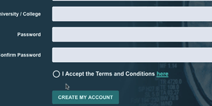

# Checkbox component with SVG tick

The effect illustrated here, uses x-show to switch between two different SVGs, one being a circle and one being a circle with a check mark inside.



```markup
@props(['label', 'name'])
<div class="flex items-center text-left" x-data="{checked: document.getElementById('{{ $name }}').checked}" >
    <div class="w-4/12"></div>
    <label class="w-8/12 pr-8 font-bold text-gray-100 cursor-pointer" for="{{ $name }}"
        x-on:click="checked = document.getElementById('{{ $name }}').checked" 
    >
        <x-svg.circle class="w-6" x-show="!checked"/>
        <x-svg.circle-check class="w-6" x-show="checked" x-cloak/>
        <input class="hidden mr-3" name="{{ $name }}" type="checkbox" id="{{ $name }}"/>
        <span>{!! $label !!}</span>
    </label>
</div>
```

Using `x-on:click` in the checkbox label updates the status of the `checked` Alpine attribute whenever the state of the checkbox changes.

The icons used were imported from Steve Schoger's heroicons and converted to Laravel 7 components. Check out [https://heroicons.dev/](https://heroicons.dev/) for an easy way to find and copy the SVG you need.  The empty circle was created by taking one of the other circular icons and deleting one of the paths.&#x20;

The actual checkbox input is hidden, but remains in sync. The technique needs some [ARIA](https://developer.mozilla.org/en-US/docs/Web/Accessibility/ARIA) tags adding to ensure accessibility.

The component is included in the view with `name` and `label` props;

```markup
<x-inputs.checkbox name="terms" label="I Accept the Terms and Conditions <a class='text-teal-400 underline hover:text-teal-200' target='_blank' href='/terms-condition'>here</a>" class=""  />
```
