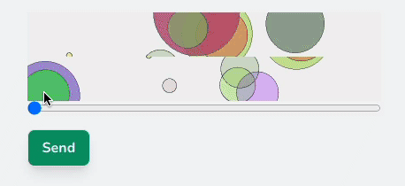

# Create a Sliding Puzzle Captcha

SlidingCaptcha is a simple class that creates a sliding puzzle.  The user must align the pieces when submitting a form such as a registration or contact form.  It does not rely on any third party API and satisfies privacy concerns.&#x20;



The background to the puzzle is generated on-the-fly by Intervention image and passed to the view as inline images.

### SlidingCaptcha Service Class

Create a class called SlidingCaptcha.  Here I have created it in a `Services` folder


```php
<?php

namespace App\Services;

use Intervention\Image\Image;
use \Intervention\Image\ImageManager;

Class SlidingCaptcha
{
    public $manager;
    public Image $top;
    public Image $bottom;
    public int $position;

    CONST CANVAS_HEIGHT = 200;
    CONST CANVAS_WIDTH = 4000;
    CONST CANVAS_BG = '#F0F0F0';

    public function __construct(Imagemanager $manager)
    {
        $this->manager = $manager;
        $this->generate();
    }

    private function generate()
    {
        $image = $this->createImage();

        $this->bottom = clone $image;
        $this->top    = clone $image;

        $this->bottom->crop(2000,50,0,50);

        $this->position = random_int(0,160)*10;  // ensures steps of 10

        $this->top->crop(400,50,$this->position,0);
        
        $this->position = 2000-$this->position;

        return;
    }

    private function createImage()
    {
        $image = $this->manager->canvas(self::CANVAS_WIDTH, self::CANVAS_HEIGHT, self::CANVAS_BG);
                
        foreach(range(1,70) as $x) {
            $image->circle(
                random_int(0,self::CANVAS_HEIGHT),  // diameter
                random_int(0,self::CANVAS_WIDTH),   // x
                random_int(0,self::CANVAS_HEIGHT),  // y
                function ($draw) {
                    $draw->background($this->colours());
                    $draw->border(1, '#444');
                });
        }

        $image->resize(self::CANVAS_WIDTH/2, self::CANVAS_HEIGHT/2);

        return $image;
    }

    private function colours()
    {
        return [
            random_int(0,255),  // range for R
            random_int(0,255),  // range for G
            random_int(0,255),  // range for B
            (rand(1,8)/10)      // range for opacity
        ];
    }
}
```


Using the popular package Intervention Image ([https://image.intervention.io/v2](https://image.intervention.io/v2)) a canvas is created which is twice the size we need.  I found making it the exact size it was too grainy.  The canvas is initially 4000px x 200px and contains 70 randomly spaced and coloured circles.

The image is then downsized to 2000px x 100px, and then split into two halves, top and bottom. Finally, the top image is cropped to 400px wide at a random position within the larger image.

### Using the Service Class

Call the Service in the controller that presents the form;

```php
        $sc = new SlidingCaptcha(new ImageManager);

        session()->put('sc_position', $sc->position);

        return view('test')->withSlidingCaptcha($sc);
```

Here we pass the SlidingCaptcha object to the view.  It contains two objects for both parts of the puzzle, and the position within the full image where the top image was taken from.  This will be what the user needs to provide by sliding the puzzle.

### The blade view

The view is very simple, and uses Tailwindcss for styling and Alpinejs to allow the user to slide the puzzle.

```markup
<form action="{{ route('contact.create') }}" method="POST"> @csrf
    <!-- rest of your form here -->
    <div class="flex flex-col" x-data="{guess:0}" x-effect="$refs.bottom.style.backgroundPosition=guess+'px';">
        <div class="w-[400px] h-[50px]" style="background-image:url('{{ $slidingCaptcha->top->encode('data-url') }}');"></div>
        <div class="w-[400px] h-[50px]" x-ref="bottom" style="background-image:url('{{ $slidingCaptcha->bottom->encode('data-url') }}');"></div>
        <input type="range" name="guess" min="0" max="1600" step="10" x-model="guess">
        @error('guess'){{ $message }}@enderror
    </div>
    <input type="submit" value="Send" class="px-4 py-2 rounded-lg bg-emerald-600 font-bold shadow-lg text-white mt-4 border"> 
</form>
```

The top half of the puzzle and the bottom half are stacked on top of each other and then a range input element provides the amount that the bottom image should be scrolled by.

Alpine links the value of the input slider with the position of the background so as the slider moves, so does the bottom image within its container.

When the two halves align, the user can try submitting the form

### Validating the input

When we created the SlidingCaptcha, we saved the `position` in session so that we can check it when the form is submitted with simple validation which can be added alongside your other validation rules.

```php
    public function create(Request $request)
    {
        $this->validate($request, [
            'guess' => ['required', Rule::in([session('sc_position')])],
        ],[
            'guess.in' => 'The puzzle must be aligned exactly'
        ]);
```

The guess from the form (the range input element) must match exactly, the position that was stored in session.  If it does then the user passed the Captcha challenge!


