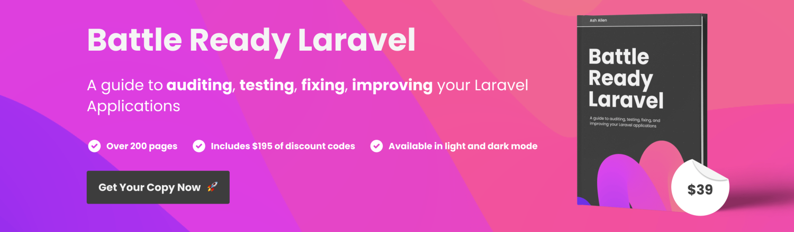

# CSRF and expired logout forms

Best practice for logging out is that the function should be driven from a form and use a csrf token to prevent someone logging you out in a [CSRF](https://owasp.org/www-community/attacks/csrf) attack.  Forcibly logging users out may cause them to disclose login credentials whilst they are being monitored.

A problem with the CSRF token in the logout form is that it can become stale in at least the following three scenarios

1. User has more than one tab open and logs out in one of them. The logout action on other tabs will now produce 419 Page Expired error
2. User has a single tab open but leaves the site and does not return during the session duration. The CSRF token is then stale and pressing logout gives 419 error.
3. The user uses the option to close all sessions on other devices. Logout on a terminated session will generate the error.

### Laravel 11+ solution

Laravel 11 removes the Http/Middleware folder and the option to add in extra logic.  The solution is to replace the ValidateCsrfMiddleware with a class that performs the same function, but adds the logout route to the except array so that when a guest user logs out, the token is not checked.

Add the following file into a new app/Http/Middleware folder


```php
<?php

namespace App\Http\Middleware;

use Closure;
use Symfony\Component\HttpFoundation\Response;
use Illuminate\Foundation\Http\Middleware\ValidateCsrfToken;
use Illuminate\Support\Facades\Auth;

class CheckCsrf extends ValidateCsrfToken
{

    protected $except = [
        // other routes that need excepting
        'stripe/*',
    ];

    public function handle($request, Closure $next): Response
    {
        if($request->route()->named('logout')) {

            if (!Auth::check() || Auth::guard()->viaRemember()) {

                $this->except[] = 'logout';
                
            }   
        }

        return parent::handle($request, $next);
    }
}
```


Then add the following into the bootstrap/app.php file


```php
->withMiddleware(function (Middleware $middleware) {
        $middleware->web(replace: [
            Illuminate\Foundation\Http\Middleware\ValidateCsrfToken::class =>
            App\Http\Middleware\CheckCsrf::class
        ]);
    })
```


Here the framework supplied middleware is swapped for our version

### Laravel 8 to 10 solution

A solution to the problem is relatively simple, and requires a small addition to the VerifyCsrfToken middleware;


```php
<?php

namespace App\Http\Middleware;

use Closure;
use Illuminate\Foundation\Http\Middleware\VerifyCsrfToken as Middleware;
use Illuminate\Support\Facades\Auth;

class VerifyCsrfToken extends Middleware
{
    /**
     * The URIs that should be excluded from CSRF verification.
     *
     * @var array
     */
    protected $except = [
        //
    ];
    
    public function handle($request, Closure $next)
    {
        if($request->route()->named('logout')) {

            if (!Auth::check() || Auth::guard()->viaRemember()) {

                $this->except[] = route('logout');
                
            }   

        }

        return parent::handle($request, $next);
    }
}

```


Normally this file contains just an `$except` array of routes that should be ignored from csrf.

### How does this help?

In this code we override the handle method and perform three checks.&#x20;

1. is the route logout
2. is the user a guest (ie, not using an authenticated session), or,
3. did the user just get logged back in via the 'Remember Me' cookie

If this is the case then we add `'logout'` to the except array.  We then pass control to the core VerifyCsrfMiddleware which recognises the presence of the logout route in the array, and bypasses the check. The form data is correctly posted and we are redirected using the LogoutResponse.

The user sees no error page.

By checking in this way, we ensure that valid logout requests by authenticated users are still protected by CSRF Token and that those with expired sessions do not see the 419 error.

<figure><figcaption><p>Affiliate Link</p></figcaption></figure>

Support the talltips site by purchasing Ash Allen's excellent book [via this link](https://ashallen.lemonsqueezy.com/?aff=1O08w)
