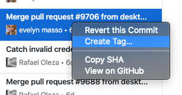

# Versioning your Laravel Project


Using Git for version control, we can tag releases and then pull that tag information into our project so that it can be displayed to users.  This can be helpful where you have multiple deployments of the same code base and need to be sure which version a site is running.

### Create a version.php config file


```php
<?php

    $tag  = exec('git describe --tags --abbrev=0');
    
    if(empty($tag)) {
        $tag = '-.-.-';
    }

    $hash = trim(exec('git log --pretty="%h" -n1 HEAD'));
    $date = Carbon\Carbon::parse(trim(exec('git log -n1 --pretty=%ci HEAD')));

return [

    'tag' => $tag,
    'date' => $date,
    'hash' => $hash,
    'string' => sprintf('%s-%s (%s)',$tag, $hash, $date->format('d/m/y H:i')),
    
];

```


The above gives our config a `version` element that we can then include within views, emails, support logs etc.

The config elements are accessed as `{{config('version.string')}}` for example.  Caching config avoids the exec functions being called on every request for the version information.

### Tagging releases

Using the github Desktop client, right click the commit and add the tag.



Using github on the web;&#x20;


Using Bitbucket.  In the Commits view, click on the latest commit and select tag from the sidebar;


