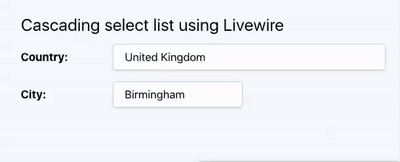

# Dynamic Cascading Dropdown with Livewire

A problem I see frequently on the [Laracasts Forum](https://laracasts.com/discuss) is people struggling with the Javascript required to create dynamic cascading dropdowns. A cascading dropdown uses one form input select box to determine the list presented by a second select. If the dataset is small, all the options can be held locally and the problem is relatively simple Javascript one.

On the other hand, if the dataset is large, the options for the second select might need to be queried from the backend. This then adds the challenge of creating an AJAX request in the browser, creating an API on the server side, and merging the returned data into the current document.

This is a lot of work for someone not comfortable with Javascript, and a lot of opportunity for issues.

I decided to see just how simple this could be using [Livewire ](https://laravel-livewire.com/)by [Caleb Porzio](https://calebporzio.com/). Livewire provides client side components that are ‘hotwired’ to Laravel components, providing two-way data-binding and automatic DOM updates.



### Setup

If you already have a project with suitable dataset, then you can skip this section.

I started with a new Laravel project (in the examples below, using Tailwind, but not relevant) and then added a dataset that could be used by the dropdowns.

After (not much!) searching, I came across a Laravel package of countries and cities which seemed it would be suitable. Other datasets are available, but this one migrated then seeded the database tables.

The package is [https://github.com/khsing/laravel-world](https://github.com/khsing/laravel-world) . Follow the instructions on the Github page to add the package, service provider and initialise the database.

Unfortunately, the package has not been recently maintained and does not understand that the string helpers have been removed. For our purposes this is not a great issue, we can create new Eloquent models and just tell them to use the `world_` tables;

```php
~/Sites/livewire (master) $ php artisan make:model Country
~/Sites/livewire (master) $ php artisan make:model City
// Country model
protected $table = 'world_countries';
//City model
protected $table = 'world_cities';
```

### Install Livewire

`composer require livewire/livewire`

All the magic of Livewire happens client side through a Javascript library that can be included near the bottom of any page that uses Livewire using a simple blade directive  `@livewireScripts` and then in the head section include the few Livewire styles with `@livewireStyles`.

OK, so now our page is ready for our component. I’m going to call this one simply `dropdowns`. An Artisan command helpfully scaffolds the Laravel module and the blade view.

`php artisan make:livewire dropdowns`

The command creates two files `app\Http\Livewire\Dropdowns.php` and `resources\views\livewire\dropdowns.blade.php`

### The View

The view element of the component is not so different from a regular blade include file. I just create the view pretty much as I would when creating a form containing select dropdowns.

```php
<div>
    <div class="mb-8">
        <label class="inline-block w-32 font-bold">Country:</label>
        <select name="country" wire:model="country" class="border shadow p-2 bg-white">
            <option value=''>Choose a country</option>
            @foreach($countries as $country)
                <option value={{ $country->id }}>{{ $country->name }}</option>
            @endforeach
        </select>
    </div>
    @if(count($cities) > 0)
        <div class="mb-8">
            <label class="inline-block w-32 font-bold">City:</label>
            <select name="city" wire:model="city" 
                class="p-2 px-4 py-2 pr-8 leading-tight bg-white border border-gray-400 rounded shadow appearance-none hover:border-gray-500 focus:outline-none focus:shadow-outline">
                <option value=''>Choose a city</option>
                @foreach($cities as $city)
                    <option value={{ $city->id }}>{{ $city->name }}</option>
                @endforeach
            </select>
        </div>
    @endif
</div>
```

The only things you might not recognise here are the `wire:model` directives. These provide two-way [data binding](https://laravel-livewire.com/docs/data-binding/) with public attributes of the back-end component. Here I have excluded the cities select element if the list would be empty. Leave lines 11 and 22 out if you would prefer to always show the second select.

The component is included in the page blade file with a Livewire directive;

```php
    <div class="flex flex-col justify-around h-full">
        @livewire('dropdowns')
    </div>
```

### Dropdowns Component

So this is your class that is going to to the back-end work 'live' for the dropdown elements

```php
<?php
namespace App\Http\Livewire;
use App\City;
use App\Country;
use Livewire\Component;
class Dropdowns extends Component
{
    public $country;
    public $cities=[];
    public $city;

    public function render()
    {
        if(!empty($this->country)) {
            $this->cities = City::where('country_id', $this->country)->get();
        }
        return view('livewire.dropdowns')
            ->withCountries(Country::orderBy('name')->get());
    }
}
```

Ok, some new stuff to get to grips with here. The public attributes are shared with the view ‘live’ whatever the public property contains, the view has access to. Initially, the cities is an empty array, as until we select a country we don’t know which cities to show.

The `render()` method is called whenever one of the elements in the view component changes, such as when the user changes the Country dropdown. Before invoking render, Livewire re-hydrates the public properties of the component. Thanks to the `wire:model` attribute on the select element, the select’s value is bound to the `country` property in our component. We can then use this to set the cities array using an Eloquent query. When the render method ends by returning the view component, the view is updated with the cities populated in the second dropdown.

We now have a working cascading dropdown. Changing the Country field presents a list of cities in the second dropdown. **Not a single line of Javascript was written.. not even a script tag.**

### Extra: The Mount() method

Suppose these dropdowns are on an edit page, where the user’s previous selection must be presented. In this case, the form is for a Concert.  The previous values can be passed into the `@livewire` directive;

```php
<div class="flex flex-col justify-around h-full">
    @livewire('dropdowns', ['country'=>$concert->country_id), 'city'=>$concert->city_id])
</div>
```

The additional two properties are passed into the `mount()` method where they can be used to initialise the country and city public properties of the Dropdown component. Since the data is bound two-way to the select element, when the page is rendered, the previous entries will be selected.

```php
<?php
namespace App\Http\Livewire;
use App\City;
use App\Country;
use Livewire\Component;
class Dropdowns extends Component
{
    public $country;
    public $cities=[];
    public $city;

    public function mount($country, $city)
    {
        $this->country=$country;
        $this->city=$city;
    }
    
    public function render()
    {
        if(!empty($this->country)) {
            $this->cities = City::where('country_id', $this->country)->get();
        }
        return view('livewire.dropdowns')
            ->withCountries(Country::orderBy('name')->get());
    }
}
```

### **Conclusion**

Livewire makes it super easy to provide areas of your web application front-end that can interact directly with your backend without writing any API or Javascript. It requires a bit of a mind shift in the way you think about how applications should be built. I’m a fan!

<figure><figcaption><p>Affiliate Link</p></figcaption></figure>

Support the talltips site by purchasing Ash Allen's excellent book [via this link](https://ashallen.lemonsqueezy.com/?aff=1O08w)
