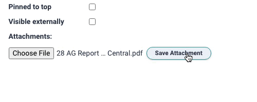

# Livewire File Uploads Using S3

## Enabling CORS on your S3 Bucket

If you want to upload directly from the browser to S3 then you need to create a CORS policy for the domain. Without the correct policy your direct upload to S3 will not be permitted, and in the browser console, you will see an error such as; `Access to XMLHttpRequest at '......' from origin 'http://example.test' has been blocked by CORS policy: Response to preflight request doesn't pass access control check: No 'Access-Control-Allow-Origin' header is present on the requested resource.` &#x20;



Go to your bucket in the S3 console, click **Permissions** then **CORS**&#x20;

Create a policy that mentions the domain name(s) of your site and the Verbs that you want to allow.

```markup
<?xml version="1.0" encoding="UTF-8"?>
<CORSConfiguration xmlns="http://s3.amazonaws.com/doc/2006-03-01/">
<CORSRule>
    <AllowedOrigin>http://mysite.test</AllowedOrigin>
    <AllowedMethod>GET</AllowedMethod>
    <AllowedMethod>PUT</AllowedMethod>
    <AllowedMethod>POST</AllowedMethod>
    <AllowedHeader>*</AllowedHeader>
</CORSRule>
<CORSRule>
    <AllowedOrigin>https://www.my-live-domain.org</AllowedOrigin>
    <AllowedMethod>GET</AllowedMethod>
    <AllowedMethod>PUT</AllowedMethod>
    <AllowedMethod>POST</AllowedMethod>
    <AllowedHeader>*</AllowedHeader>
</CORSRule>
</CORSConfiguration>

```

## Removing filename from input field after upload

If you have a view in which the file upload control remains on-screen after completing an upload, you will find that after saving the upload, the file input cannot be returned to the 'No file chosen' state.  The file input element is immutable and cannot be set or cleared.

One trick is to give the upload button an id that is specified in the Livewire back-end component. A simple counter suffices.  After the upload of a file, increment the count. The component will be removed from the dom and replaced with a new file input element using a new ID - and an empty filename.



```markup
<input wire:model="attachment" type="file" name="attachment" id="upload{{ $iteration }}" />
```

After saving

```php
        //clean up
        $this->attachment=null;
        $this->iteration++;
        
```
