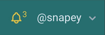

# Swinging Bell Notification Icon

Using an SVG Bell icon and custom tailwind class, we can make a bell symbol that swings to draw the user's attention.



### Create the Icon

Not a requirement for this example (you could in-line the SVG) but here I have downloaded one of the Heroicons from [https://heroicons.dev/](https://heroicons.dev/) and made it into a Laravel 7 component.

views/components/svg/bell.blade.php

```
<svg fill="none" viewBox="0 0 24 24" stroke="currentColor" {{ $attributes->merge(['class'=>'inline-block']) }}>
    <path stroke-linecap="round" stroke-linejoin="round" stroke-width="2"
        d="M15 17h5l-1.405-1.405A2.032 2.032 0 0118 14.158V11a6.002 6.002 0 00-4-5.659V5a2 2 0 10-4 0v.341C7.67 6.165 6 8.388 6 11v3.159c0 .538-.214 1.055-.595 1.436L4 17h5m6 0v1a3 3 0 11-6 0v-1m6 0H9">
    </path>
</svg>
```

This uses most of the code copied from the heroicons site, but with the addition of merging any passed attributes.

### Create the blade content for the bell

```markup
@if($notifications->count() > 0)
    <span class="text-base tracking-tighter text-yellow-500">
        <x-svg.bell class="h-5 -mr-1 align-text-top animate-swing origin-top"/>
        <sup>{{ $notifications->count() }}</sup>
    </span>
@endif
```

### Create Tailwind Extension

In the code above, you will see a new class; `animate-swing`we add this using the tailwind.config.js file

```javascript
extend: {
      keyframes: {
        'swing': {
          '0%,100%' : { transform: 'rotate(15deg)' },
          '50%' : { transform: 'rotate(-15deg)' },
        }
      },
      animation: {
        'swing': 'swing 1s infinite'
      }
    }
```

The bell is rotated around a point that is in the centre top of the icon, starting at 15 degrees through 0 degrees to -15 degrees and back again over a 1 second duration.
